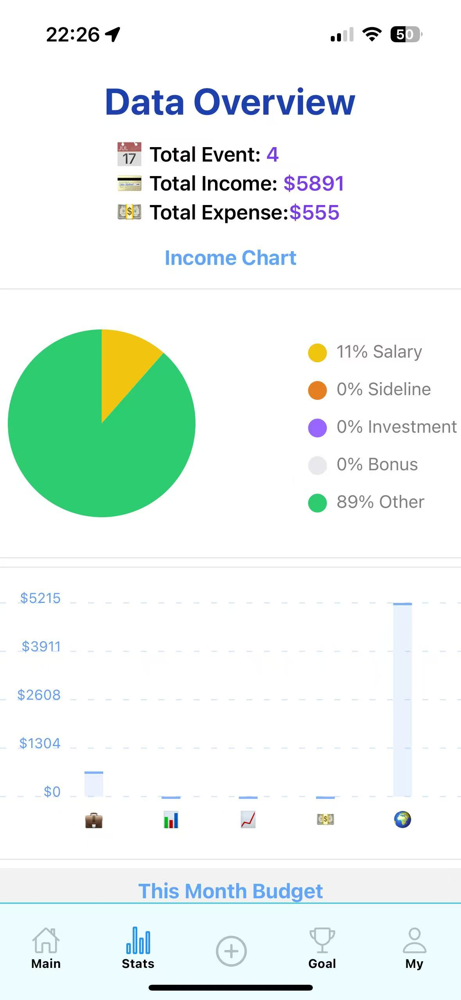

# Money Recorder
https://apps.apple.com/us/app/moneyrecorder/id6744058988

A modern, feature-rich personal finance management mobile application built with React Native and Appwrite. Track your expenses, set budgets, monitor savings goals, and gain insights into your financial habits with a beautiful and intuitive interface.

## Features

### 💰 Expense & Income Tracking

- Record daily expenses and income with detailed categorization
- Support multiple expense categories (Eating, Traffic, Shopping, Entertainment, Living, etc.)
- Add custom tags, locations, and comments to transactions
- View transaction history with comprehensive filtering and search capabilities
- Multiple payment method support (Cash, Card, Transfer)

### 📊 Financial Analytics

- Interactive pie charts for expense and income category distribution
- Dynamic bar charts for monthly financial trends
- Detailed category-wise expense breakdown
- Income vs. Expense analysis with monthly comparisons
- Real-time financial statistics and insights

### 💹 Budget Management

- Set and manage monthly budgets for different expense categories
- Real-time budget tracking with visual progress indicators
- Category-specific budget monitoring
- Smart budget alerts and notifications
- Historical budget performance analysis

### 🎯 Savings Goals

- Create and track multiple savings goals
- Set target amounts and deadlines for financial objectives
- Monitor progress with visual indicators
- Categorize savings goals for better organization
- Track completion status and history

### 🌓 User Experience

- Intuitive and responsive user interface
- Dark mode support for comfortable viewing
- Multi-language support (English and Chinese)
- Offline data persistence
- Real-time data synchronization
- Smart search functionality

## Demo

### Home Page


### Stats Page



### Record Management

<div align="center">
  
  
</div>

### Deposit Goal Page


### My Profile Page


## Technology Stack

### Frontend Framework

- **React Native with Expo**: A powerful framework for building cross-platform mobile applications, providing a smooth and native user experience.

### UI/Styling

- **NativeWind (TailwindCSS for React Native)**: Utility-first CSS framework that enables rapid UI development with consistent styling.
- **@expo/vector-icons**: Comprehensive icon set for enhanced UI elements.

### Backend Service

- **Appwrite**: Secure and scalable backend platform providing:
  - User authentication and management
  - Real-time database operations
  - File storage and management
  - Cloud functions and automation

### State Management

- **React Context API**: Efficient global state management for:
  - Theme preferences (Light/Dark mode)
  - Language settings
  - User authentication state
  - App configuration

### Data Visualization

- **React Native Chart Kit**: Advanced charting library for:
  - Interactive pie charts
  - Dynamic bar charts
  - Financial trend analysis
  - Budget progress visualization

### Navigation

- **Expo Router**: File-based routing system providing:
  - Seamless screen navigation
  - Deep linking support
  - Type-safe routing
  - Nested navigation structures

### Storage & Persistence

- **@react-native-async-storage/async-storage**: Local data persistence for:
  - User preferences
  - Offline data access
  - Cache management
  - Session handling

### Animation & Interaction

- **React Native Reanimated**: Fluid animations and interactions
- **React Native Safe Area Context**: Adaptive layout management

## Development Environment

### Required Software

- Node.js (v14 or higher)
- npm (v6 or higher) or Yarn
- Expo CLI
- Xcode (for iOS development)
- Android Studio (for Android development)
- Git

### Recommended Tools

- VS Code with React Native extensions
- React Native Debugger
- Expo Go mobile app for testing

## Project Structure

```
├── app/                  # Main application screens
│   ├── (func)/          # Core functionality components
│   │   ├── Budget.tsx   # Budget management
│   │   ├── depositGoal.tsx # Savings goals
│   │   ├── editRecord.tsx  # Record editing
│   │   └── recordDetail.tsx # Record details
│   ├── (profile)/       # User profile related screens
│   │   ├── settings.tsx # App settings
│   │   └── more.tsx     # Additional features
│   └── (tabs)/          # Main navigation tabs
├── assets/              # Static assets and images
├── components/          # Reusable UI components
├── constants/           # App constants and configurations
├── contexts/            # Global state management
├── services/            # Backend services and API
├── utils/               # Utility functions and helpers
│   ├── __tests__/      # Unit tests
│   ├── themeUtils.ts   # Theme utilities
│   └── validationUtils.ts # Input validation
```

## Getting Started

### Prerequisites

1. Install Node.js and npm
2. Install Expo CLI globally:

```bash
npm install -g expo-cli
```

### Installation

1. Clone the repository

```bash
git clone https://github.com/HAONANTAO/Money_Recorder.git
cd Money_Recorder
```

2. Install dependencies

```bash
npm install
```

3. Configure environment variables
   Create a `.env` file in the root directory:

```env
APPWRITE_ENDPOINT=your_appwrite_endpoint
APPWRITE_PROJECT_ID=your_project_id
```

4. Start the development server

```bash
npx expo start
```

### Running Tests

Run unit tests:

```bash
npm test
```

Run tests with coverage:

```bash
npm test -- --coverage
```

### Development

1. Start the development server:

```bash
npm run dev
```

2. Run on devices:

- iOS: Press 'i' to open iOS simulator
- Android: Press 'a' to open Android emulator
- Physical device: Scan QR code with Expo Go app

## How to ditribute App in Ios Store
<details>
  <summary>📦 How to Publish React Native App to the iOS App Store</summary>

  Here’s a high-level step-by-step guide to release a React Native app to the iOS App Store:

  1. **Create an Apple Developer Account**
     - Sign up at [developer.apple.com](https://developer.apple.com) ($99/year).

  2. **Configure Your App for Release**
     - Update `app.json` or `Info.plist` with proper `name`, `version`, `bundleIdentifier`, etc.
     - Use production-ready assets (icons, splash screens).
     - If using Expo: set `"ios": { "buildNumber": "1.0.0", "bundleIdentifier": "com.yourname.yourapp" }`.

  3. **Set Up Certificates and Profiles**
     - Use Xcode or [Apple Developer Console](https://developer.apple.com/account/resources/) to create:
       - **App ID**
       - **Provisioning Profile**
       - **Distribution Certificate**

  4. **Build the iOS App**
     - **With Expo:**
       ```bash
       eas build --platform ios
       ```
       Make sure you're logged in to an Apple Developer account.
     - **Without Expo (Bare React Native):**
       ```bash
       cd ios
       pod install
       open YourApp.xcworkspace
       ```
       Then build the archive using **Xcode** → **Product** → **Archive**.

  5. **Test with TestFlight (optional but recommended)**
     - Upload the archive using **Xcode** or **Transporter**.
     - Set up internal/external testers in App Store Connect.

  6. **Submit for Review**
     - Go to [App Store Connect](https://appstoreconnect.apple.com/)
     - Fill in app details, upload screenshots, set pricing and availability.
     - Submit your build for review.

  7. **Wait for Approval**
     - Apple will review your app and usually respond within a few days.
     - Once approved, your app will be available on the App Store.

</details>


## Contributing

Contributions are welcome! Please feel free to submit a Pull Request. For major changes, please open an issue first to discuss what you would like to change.

## License

This project is licensed under the MIT License - see the [LICENSE](LICENSE) file for details.

## Contact

Haonan Tao - taoaaron5@gmail.com

Project Link: [https://github.com/HAONANTAO/Money_Recorder](https://github.com/HAONANTAO/Money_Recorder)
