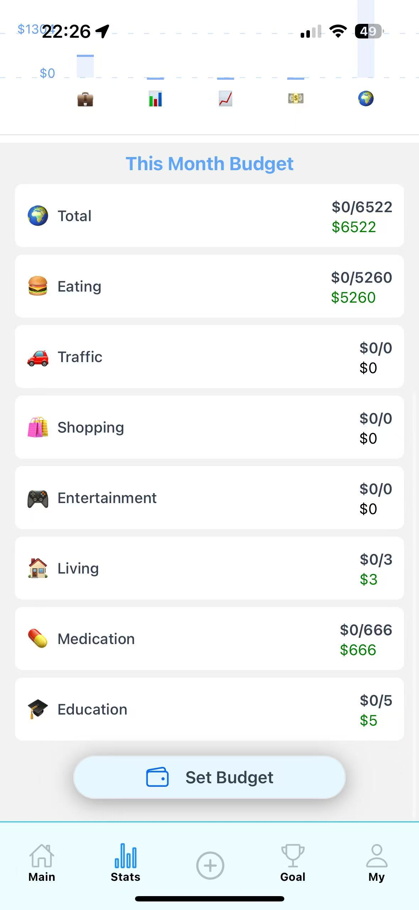

# 💰 Money Recorder

[Download on the App Store](https://apps.apple.com/us/app/moneyrecorder/id6744058988)

A modern, feature-rich personal finance management app for iOS, designed to help you effortlessly track expenses, set budgets, and achieve your savings goals-all within an intuitive, visually appealing interface.

Built independently with React Native (Expo), Appwrite, and NativeWind, Money Recorder delivers a seamless, cross-platform experience with real-time sync, interactive analytics, and robust privacy features.

[](https://expo.dev/)
[](https://reactnative.dev/)
[](https://react.dev/)
[](https://appwrite.io/)
[](https://react-native-async-storage.github.io/async-storage/)
[](https://tailwindcss.com/)
[](https://www.typescriptlang.org/)

---

<p align="center">
  
  
  
</p>
<p align="center">
  
  
</p>

## Table of Contents

- [Description](#description)
- [Features](#features)
- [Demo](#demo)
- [Technology Stack](#technology-stack)
- [Getting Started](#getting-started)
- [How to Distribute App in iOS Store](#how-to-distribute-app-in-ios-store)
- [Contributing](#contributing)
- [Contact](#contact)
- [License](#license)


---
## Description

**Money Recorder** empowers users to:

- **Track expenses and income** with automatic categorization and detailed breakdowns.
- **Set and monitor budgets** to control spending and receive smart reminders.
- **Manage savings goals** with real-time progress tracking.
- **Analyze finances** using interactive charts and detailed financial reports.
- **Enjoy a beautiful, intuitive interface** designed for ease of use and efficiency.

### Highlights

- 🔄 Real-time cloud sync for seamless access across devices
- 🌏 Multi-language support (English & Chinese)
- 📊 Advanced financial analytics and interactive charts
- 🔒 Secure data storage and privacy protection
- 📱 Offline data persistence for uninterrupted access

---

> *Money Recorder provides deep insights into your financial habits, helping you achieve your financial goals efficiently and securely.*

## Features

### 💰 Expense & Income Tracking
- Record daily expenses and income with detailed categorization
- Support multiple expense categories (Eating, Traffic, Shopping, Entertainment, Living, etc.)
- Add custom tags, locations, and comments to transactions
- View transaction history with comprehensive filtering and search
- Multiple payment method support (Cash, Card, Transfer)

### 📊 Financial Analytics
- Interactive pie charts for expense and income distribution
- Dynamic bar charts for monthly financial trends
- Detailed category-wise expense breakdowns
- Income vs. expense analysis with monthly comparisons
- Real-time statistics and actionable insights

### 💹 Budget Management
- Set and manage monthly budgets for different categories
- Real-time budget tracking with visual progress bars
- Category-specific budget monitoring
- Smart budget alerts and notifications
- Historical budget performance analysis

### 🎯 Savings Goals
- Create and track multiple savings goals
- Set target amounts and deadlines for each goal
- Monitor progress with visual indicators
- Categorize and organize savings objectives
- Track completion status and goal history

### 🌓 User Experience
- Intuitive and responsive user interface
- Dark mode support for comfortable viewing
- Multi-language support (English & Chinese)
- Offline data persistence for uninterrupted access
- Real-time data synchronization across devices
- Smart and fast search functionality


## Demo

### Home Page
<p align="center">
  
</p>

### Stats Page
<p align="center">
  
</p>

### Record Management
<p align="center">
  
  
</p>

### Deposit Goal Page
<p align="center">
  
</p>

### My Profile Page
<p align="center">
  
</p>

## Technology Stack

### 🖼️ Frontend Framework
- **React Native with Expo**  
  Build robust, cross-platform mobile apps with native-like performance and smooth user experience.

### 🎨 UI & Styling
- **NativeWind (TailwindCSS for React Native):** Rapid, utility-first styling for consistent UI.
- **@expo/vector-icons:** Rich icon library for modern interfaces.

### 🔗 Backend Service
- **Appwrite:** Secure, scalable backend platform featuring:
  - User authentication & management
  - Real-time database
  - File storage
  - Cloud functions & automation

### 🗂️ State Management
- **React Context API:** Efficient global state for:
  - Theme (Light/Dark)
  - Language
  - Auth
  - App config

### 📊 Data Visualization
- **React Native Chart Kit:** Advanced charting for:
  - Interactive pie/bar charts
  - Financial trends
  - Budget progress

### 🧭 Navigation
- **Expo Router:** File-based routing, deep linking, type-safe navigation, nested routes.

### 💾 Storage & Persistence
- **@react-native-async-storage/async-storage:** Local storage for:
  - User preferences
  - Offline data
  - Caching
  - Session management

### 🎬 Animation & Interaction
- **React Native Reanimated:** Smooth, performant animations.
- **React Native Safe Area Context:** Adaptive layouts for all devices.

---

## Development Environment

### Required Software
- Node.js (v14+)
- npm (v6+) or Yarn
- Expo CLI
- Xcode (iOS)
- Android Studio (Android)
- Git

### Recommended Tools
- VS Code (+ React Native extensions)
- React Native Debugger
- Expo Go app for testing


## Project Structure

```
├── app/                  # Main application screens
│   ├── (func)/          # Core functionality components
│   │   ├── Budget.tsx   # Budget management
│   │   ├── depositGoal.tsx # Savings goals
│   │   ├── editRecord.tsx  # Record editing
│   │   └── recordDetail.tsx # Record details
│   ├── (profile)/       # User profile related screens
│   │   ├── settings.tsx # App settings
│   │   └── more.tsx     # Additional features
│   └── (tabs)/          # Main navigation tabs
├── assets/              # Static assets and images
├── components/          # Reusable UI components
├── constants/           # App constants and configurations
├── contexts/            # Global state management
├── services/            # Backend services and API
├── utils/               # Utility functions and helpers
│   ├── __tests__/      # Unit tests
│   ├── themeUtils.ts   # Theme utilities
│   └── validationUtils.ts # Input validation
```

## Getting Started

### Prerequisites

1. Install Node.js and npm
2. Install Expo CLI globally:

```bash
npm install -g expo-cli
```

### Installation

1. Clone the repository

```bash
git clone https://github.com/HAONANTAO/Money_Recorder.git
cd Money_Recorder
```

2. Install dependencies

```bash
npm install
```

3. Configure environment variables
   Create a `.env` file in the root directory:

```env
APPWRITE_ENDPOINT=your_appwrite_endpoint
APPWRITE_PROJECT_ID=your_project_id
```

4. Start the development server

```bash
npx expo start
```

### Running Tests

Run unit tests:

```bash
npm test
```

Run tests with coverage:

```bash
npm test -- --coverage
```

### Development

1. Start the development server:

```bash
npm run dev
```

2. Run on devices:

- iOS: Press 'i' to open iOS simulator
- Android: Press 'a' to open Android emulator
- Physical device: Scan QR code with Expo Go app

## How to Distribute App in iOS Store

<details>
  <summary>📦 How to Publish React Native App to the iOS App Store (2025)</summary>

  Here’s a high-level, up-to-date step-by-step guide to release a React Native app to the iOS App Store:

  1. **Create an Apple Developer Account**
     - Sign up at [developer.apple.com](https://developer.apple.com) ($99/year).

  2. **Ensure SDK and Xcode Requirements**
     - As of April 2025, all iOS apps **must be built with Xcode 16+ and the iOS 18 SDK**.  
       ([source][5][1][4])
     - Update your local Xcode and Expo SDK (Expo 50+ recommended for managed workflow).

  3. **Configure Your App for Release**
     - Update `app.json` or `Info.plist` with correct `name`, `version`, `bundleIdentifier`, etc.
     - Use production-ready assets (icons, splash screens).
     - For Expo: set `"ios": { "buildNumber": "1.0.0", "bundleIdentifier": "com.yourname.yourapp" }`.

  4. **Set Up Certificates and Profiles**
     - In Xcode or the [Apple Developer Console](https://developer.apple.com/account/resources/):
       - **App ID**
       - **Provisioning Profile**
       - **Distribution Certificate**

  5. **Build the iOS App**
     - **Expo (Recommended):**
       ```
       eas build --platform ios
       ```
       - Make sure you’re logged in to your Apple Developer account.
     - **Bare React Native:**
       ```
       cd ios
       pod install
       open YourApp.xcworkspace
       ```
       - Build archive via Xcode: **Product > Archive**.

  6. **Test with TestFlight (Recommended)**
     - Upload the archive using Xcode Organizer or Transporter.
     - Set up testers in App Store Connect.

  7. **Submit for Review**
     - Go to [App Store Connect](https://appstoreconnect.apple.com/).
     - Fill in app details, upload screenshots, set pricing/availability.
     - Submit your build for review.

  8. **Wait for Approval**
     - Apple reviews usually take 1–3 days.
     - Once approved, your app will be live on the App Store.

  ### Checklist Before Submitting
  - ✅ Test thoroughly on real devices and via TestFlight
  - ✅ Ensure all screenshots, descriptions, and metadata are ready
  - ✅ Follow all [Apple App Store Guidelines](https://developer.apple.com/app-store/review/guidelines/)
  - ✅ Provide a privacy policy URL
  - ✅ Remove any placeholder or debug content
  - ✅ Monitor app performance and crash logs

  For more details, see [React Native Official Guide][2] or [Instabug 2025 Submission Guide][3].

</details>


##  Contributing

Contributions are welcome!  
If you have suggestions for improvements, bug fixes, or new features, please submit a Pull Request.  
For major changes, open an Issue first to discuss your ideas with the project maintainers.

1. Fork the repository
2. Create your feature branch (`git checkout -b feature/YourFeature`)
3. Commit your changes (`git commit -m 'Add some feature'`)
4. Push to the branch (`git push origin feature/YourFeature`)
5. Open a Pull Request

---

##  Contact

- **Name:** Aaron TAO
- **Email:** [taoaaron5@gmail.com](mailto:taoaaron5@gmail.com)
- **GitHub:** [HAONANTAO](https://github.com/HAONANTAO)
- **LinkedIn:** [Aaron Tao](https://www.linkedin.com/in/haonan-tao-aaron)
- **Project Link:** [https://github.com/HAONANTAO/Money_Recorder](https://github.com/HAONANTAO/Money_Recorder)

---

## License

This project is licensed under the MIT License.  
See the [LICENSE](LICENSE) file for details.

